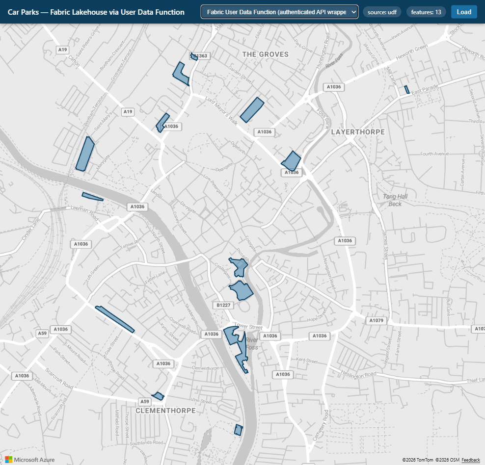

# Fabric Lakehouse → User Data Function → Azure Maps

A working, local-first demo that renders a **GeoJSON file stored in a Microsoft
Fabric Lakehouse** on a web map using the **Azure Maps Web SDK**.

The same file — `Files/GeoJson/Car_Parks.geojson` (13 York car-park polygons) —
is pulled in **two different ways**, each a proof-of-concept you can switch
between live in the UI. There is **one doc per approach** in [`docs/`](docs/).



## What's here

```
fabric-udf-maps-demo/
  public/            # Browser app: Azure Maps Web SDK, renders the FeatureCollection
  server/            # Zero-dependency Node proxy (BFF): acquires tokens, calls the sources
  fabric-udf/        # The Fabric User Data Function (Python) + REST deploy script
  docs/              # One doc per POC + architecture + anonymous-access exploration
  .env.example       # Copy to .env and fill in (real .env is gitignored)
```

## The POCs (same file, different retrieval paths)

| # | Source (UI dropdown) | How the data is pulled | Doc |
|---|----------------------|------------------------|-----|
| 1 | **OneLake direct file read** | Server reads the file straight from OneLake (DFS API), authenticated with an Entra token | [docs/poc-1-onelake-direct.md](docs/poc-1-onelake-direct.md) |
| 2 | **Fabric User Data Function** | Server calls the **published UDF**, which reads the Lakehouse file *inside* Fabric and returns it — an API wrapper that controls exposure | [docs/poc-2-fabric-udf.md](docs/poc-2-fabric-udf.md) |

See also:
- [docs/architecture.md](docs/architecture.md) — how the pieces fit; why a backend proxy (BFF).
- [docs/anonymous-access-options.md](docs/anonymous-access-options.md) — **exploration only** (not built): ways to expose OneLake data to anonymous/public customers outside Fabric, and their tradeoffs.

Both built POCs are **authenticated** (an Entra token is acquired server-side).
Fabric UDFs, OneLake, GraphQL and SQL endpoints are **never anonymous** — see the
anonymous-access doc for what public exposure actually requires.

## Run it locally

Prereqs: Node 18+, Azure CLI (`az login` with access to the workspace), an Azure
Maps subscription key.

```powershell
cd fabric-udf-maps-demo
Copy-Item .env.example .env      # then edit .env: set AZURE_MAPS_KEY
npm start                        # no npm install needed — zero dependencies
# open http://localhost:3000
```

Pick a source in the top-left dropdown and click **Load**. The canvas clears to
the base map (Azure Maps `grayscale_light`), then the chosen path fetches and
renders the data.

- **OneLake (default):** works immediately if you're `az login`'d with read access.
- **Fabric UDF:** already wired to the published `CarParksApi` function. To point
  at your own, publish it (see [docs/poc-2](docs/poc-2-fabric-udf.md)) and set
  `UDF_ENDPOINT` in `.env`.

## The shared lakehouse (defaults)

```
workspace  61077f32-d21a-4791-b383-cacbddf222f5
lakehouse  b97fcfa2-6e58-4898-ab81-00ed5d1396cb
file       Files/GeoJson/Car_Parks.geojson
```

## Security notes

- `.env` (which holds the Azure Maps key) is **gitignored** — never commit it.
- The Azure Maps subscription key is exposed to the browser; fine for a local
  prototype. For production use Entra auth or SAS tokens for Azure Maps.
- The UDF endpoint always requires an Entra token; the proxy acquires it
  server-side (via `az`). It is **not** an anonymous endpoint.
