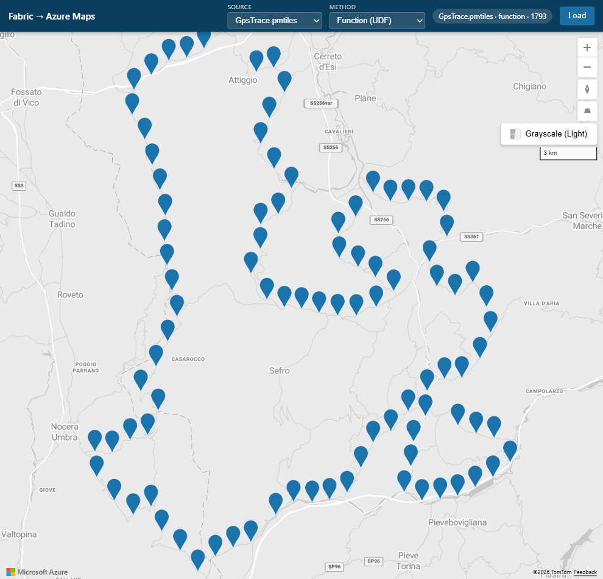

# Set up the Fabric User Data Functions

> **Journey:** [README](../README.md) → prerequisites: [Data setup](data_setup.md) + [UDF guide](udf-guide.md) → **UDF setup** → [App deployment](app-guide.md) → [Authorization](auth.md)

## 1. Prerequisites

Complete [Fabric data setup](data_setup.md), then read [Fabric User Data Functions](udf-guide.md). Authorization is completed later in [Authorization and identity](auth.md); this guide links to the relevant authorization sections without repeating their procedures.

## 2. Architecture

The solution is a UDF-only Node Backend-for-Frontend (BFF) that renders four Fabric sources on Azure Maps. The browser calls fixed BFF routes, and the BFF invokes four known published Fabric UDFs rather than exposing Fabric endpoints to the browser.

The production BFF runs in Azure App Service and uses its hosted system-assigned managed identity to invoke the UDFs. The car parks, PMTiles, and airports UDFs read through three Fabric-managed Lakehouse connections, while the Eventstream UDF uses its own runtime identity to read the Eventhouse database. The Web App receives no Lakehouse, Eventhouse, or other source-read grant.

The BFF also obtains a short-lived Azure Maps token for the browser. The browser receives only map data and that short-lived Maps token; it never receives Fabric tokens, UDF invocation tokens, source credentials, or connection credentials. The backend limits operations to the four known sources, unwraps and normalizes UDF results, and relays PMTiles archive bytes with HTTP Range support.

For Fabric UDF concepts, see [Fabric user data functions overview](https://learn.microsoft.com/en-us/fabric/data-engineering/user-data-functions/user-data-functions-overview).

## 3. End-to-end request flow

1. `GET /api/config` returns Azure Maps authentication metadata and exactly four source descriptors. Each descriptor contains only `id`, `label`, `realtime`, and `view`.
2. `GET /api/data?source=<carpark|airports|eventstream>` invokes the selected published UDF with `POST`, the empty JSON body `{}`, and the audience `https://analysis.windows.net/powerbi/api`; the BFF unwraps the Fabric response envelope and returns map-ready JSON.
3. `GET /api/maps-token` uses the App Service identity to obtain a short-lived Azure Maps token.
4. `GET /api/pmtiles-archive` has no application query and supports HTTP Range requests. The PMTiles UDF returns the complete archive as base64, the BFF decodes and caches the archive, and the route relays requested byte ranges.
5. The browser uses `pmtiles://` with `pmtiles.js` to read and decode vector tiles from the relayed archive. The server does not extract individual tiles.

There is no method selector.

| Order | `id` | `label` | `realtime` | Verified `view` |
| --- | --- | --- | --- | --- |
| 1 | `carpark` | `Car_Parks.geojson` | `false` | Center `[-1.08, 53.96]`, zoom `12` |
| 2 | `pmtiles` | `GpsTrace.pmtiles` | `false` | Center `[12.9664245, 43.183583]`, zoom `10` |
| 3 | `airports` | `airports-lakehouse` | `false` | Center `[15, 20]`, zoom `1.5` |
| 5 | `eventstream` | `Bicycle-eventstream` | `true` | Center `[-0.12, 51.5]`, zoom `10` |

For the authenticated invocation model, see [Invoke Fabric UDFs from an application](https://learn.microsoft.com/en-us/fabric/data-engineering/user-data-functions/tutorial-invoke-from-python-app).

## 4. Configuration seam

Customer-editable non-secret defaults live in `config/constants.js`. The only supported keys are `mapsClientId`, `udf.resource`, `udf.carpark`, `udf.pmtiles`, `udf.airports`, and `udf.eventstream`.

At runtime, `server/lib/config.js` loads `.env` for local development. A non-empty environment variable takes precedence over the corresponding value in `config/constants.js`; an absent or empty variable leaves the constant in effect.

| Runtime variable | Default or fallback | Purpose |
| --- | --- | --- |
| `PORT` | `3000` | BFF listening port. |
| `AZURE_MAPS_CLIENT_ID` | `mapsClientId` | Azure Maps account client ID used for Entra authentication. |
| `AZURE_MAPS_KEY` | Empty | Local-development-only Maps key fallback; never use it in production. |
| `UDF_RESOURCE` | `udf.resource` | Fabric UDF token audience. |
| `UDF_CARPARK_ENDPOINT` | `udf.carpark` | Car parks UDF Public URL. |
| `UDF_PMTILES_ENDPOINT` | `udf.pmtiles` | PMTiles UDF Public URL. |
| `UDF_AIRPORTS_ENDPOINT` | `udf.airports` | Airports UDF Public URL. |
| `UDF_EVENTSTREAM_ENDPOINT` | `udf.eventstream` | Eventstream UDF Public URL. |

Use environment overrides when the hosted deployment must differ from the checked-in non-secret defaults. Never place secrets or credentials in `config/constants.js`; the Maps key fallback is local-development-only and must never be stored there.

## 5. Reusable UDF creation pattern

Use this portal sequence for each source, with the source-specific details in sections 6–9:

1. In the Fabric portal, open the workspace created during [data setup](data_setup.md).
2. Select **+ New item**, search for **User Data Functions**, select the item type, enter a descriptive name, and select **Create**.
3. Open **Develop** mode and replace the sample Python with the matching checked-in file.
4. Configure the required connection or library, then run or test the function as appropriate.
5. Select **Publish** and wait for publishing to finish. A later publish can require an approximately two-minute cooldown.
6. Switch to **Run only**, open the function's **...** menu, select **Properties**, set **Public access = On**, and copy the **Public URL**.
7. Manually place the Public URL in the matching `config/constants.js` key described in section 10.

For the generic portal experience, see [Create a UDF item in the portal](https://learn.microsoft.com/en-us/fabric/data-engineering/user-data-functions/create-user-data-functions-portal) and [Use the UDF portal editor](https://learn.microsoft.com/en-us/fabric/data-engineering/user-data-functions/user-data-functions-portal-editor). For managed connections, see [Connect Fabric UDFs to data sources](https://learn.microsoft.com/en-us/fabric/data-engineering/user-data-functions/connect-to-data-sources).

**Public access = On** makes the endpoint internet-reachable but does not make it anonymous; Microsoft Entra authentication is still required. Complete [Fabric tenant access](auth.md#enable-fabric-tenant-access) and [Execute permission on each UDF](auth.md#grant-execute-on-each-udf) during authorization.

Keep each response within the Fabric public-endpoint limits: a 100-second timeout and a 30 MB response limit. See [Fabric UDF service limits](https://learn.microsoft.com/en-us/fabric/data-engineering/user-data-functions/user-data-functions-service-limits) for current limits and publish constraints.

## 6. Car parks UDF

1. Create a UDF item with a descriptive name such as **Car parks UDF** and replace the sample code with `fabric-udf/carpark_function_app.py`.
2. Confirm that the published function is `get_car_parks`, the connection alias in the code is `carparkslh`, and the UDF reads `GeoJson/Car_Parks.geojson` through `connectToFiles()`.
3. On the ribbon, select **Manage connections** → **Add data connection** → **OneLake catalog**, choose the Lakehouse created during [data setup](data_setup.md), and select **Connect**.
4. Set the connection alias to `carparkslh` and select **Update**. The portal alias must exactly match the decorator alias.
5. Run the function and confirm that it returns a valid GeoJSON dictionary.
6. Publish the item, switch to **Run only**, set **Public access = On** in `get_car_parks` properties, copy the Public URL, and place it in `udf.carpark`.

## 7. PMTiles UDF

1. Create a UDF item with a descriptive name such as **GPS trace PMTiles UDF** and replace the sample code with `fabric-udf/pmtiles_function_app.py`.
2. Confirm that the published function is `get_gpstrace_pmtiles`, the connection alias is `gpstracelh`, and the UDF reads `GeoJson/GpsTrace.pmtiles` through `connectToFiles()`.
3. Select **Manage connections** → **Add data connection** → **OneLake catalog**, choose the Lakehouse created during [data setup](data_setup.md), and select **Connect**.
4. Set the connection alias to `gpstracelh`, select **Update**, and run the function. The result must be a non-empty base64 string.
5. Publish the item, switch to **Run only**, set **Public access = On** in `get_gpstrace_pmtiles` properties, copy the Public URL, and place it in `udf.pmtiles`.

The UDF returns the complete archive rather than individual vector tiles. The BFF validates, decodes, and caches the base64 archive, then serves archive bytes with Range support; the browser uses `pmtiles.js` and `pmtiles://` to interpret the vector tiles. For protocol background, see [Add the PMTiles custom protocol to Azure Maps](https://learn.microsoft.com/en-us/azure/azure-maps/add-custom-protocol-pmtiles).

## 8. Airports UDF

1. Create a UDF item with a descriptive name such as **Airports UDF** and replace the sample code with `fabric-udf/airports_function_app.py`.
2. Confirm that the published function is `get_airports`, the connection alias is `airportslh`, and the UDF uses `connectToSql()` with `SELECT TOP 100 * FROM dbo.airports`.
3. Select **Manage connections** → **Add data connection** → **OneLake catalog**, choose the Lakehouse created during [data setup](data_setup.md), and select **Connect**.
4. Set the connection alias to `airportslh`, select **Update**, and run the function. Confirm that the result is a list of up to 100 row dictionaries and that data rows contain `_c6` latitude and `_c7` longitude values.
5. Publish the item, switch to **Run only**, set **Public access = On** in `get_airports` properties, copy the Public URL, and place it in `udf.airports`.

The BFF maps `_c6` to latitude and `_c7` to longitude, converts valid rows to GeoJSON point features, and skips rows whose coordinates are invalid.

## 9. Eventstream UDF

1. Before copying the code, manually edit `CLUSTER_URI`, `DATABASE`, and `TABLE` at the top of `fabric-udf/eventstream_function_app.py` using the Eventhouse values recorded during [data setup](data_setup.md). The expected table is `BicycleES` unless you intentionally created another table and update `TABLE` accordingly.
2. Create a UDF item with a descriptive name such as **Bicycle Eventstream UDF** and replace the sample code with the edited `fabric-udf/eventstream_function_app.py`.
3. Do not add a Fabric-managed connection. This function uses `azure-kusto-data` with `DefaultAzureCredential` so the UDF runtime identity reads the Eventhouse database.
4. Open **Library management**, add the latest compatible public PyPI `azure-kusto-data` library without pinning a version, and wait for the environment update to complete.
5. Run `get_bikes`. It queries the newest approximately 100 rows that have `Latitude` and `Longitude`; a first invocation without source authorization can return an error containing the complete rejected runtime principal. Copy that principal exactly and follow [Grant the Eventstream UDF Kusto access](auth.md#grant-the-eventstream-udf-kusto-access).
6. After authorization, run the function again and confirm that it returns a list of bicycle row dictionaries containing numeric `Latitude` and `Longitude`.
7. Publish the item, switch to **Run only**, set **Public access = On** in `get_bikes` properties, copy the Public URL, and place it in `udf.eventstream`.

## 10. Update `config/constants.js`

Manually edit `config/constants.js` in the repository web editor or another text editor. Public URLs and the Maps client ID are non-secret identifiers, but secrets and credentials never belong in this file.

| Key | Value | Obtained from | Fixed or tenant-specific | Override |
| --- | --- | --- | --- | --- |
| `mapsClientId` | Azure Maps account client ID; non-secret. | Azure Maps account authentication details prepared during app deployment. | Tenant-specific. | `AZURE_MAPS_CLIENT_ID` |
| `udf.resource` | `https://analysis.windows.net/powerbi/api` | Fabric UDF invocation audience. | Fixed. | `UDF_RESOURCE` |
| `udf.carpark` | `get_car_parks` Public URL; non-secret identifier. | Car parks UDF → **Run only** → function **Properties**. | Tenant-specific. | `UDF_CARPARK_ENDPOINT` |
| `udf.pmtiles` | `get_gpstrace_pmtiles` Public URL; non-secret identifier. | PMTiles UDF → **Run only** → function **Properties**. | Tenant-specific. | `UDF_PMTILES_ENDPOINT` |
| `udf.airports` | `get_airports` Public URL; non-secret identifier. | Airports UDF → **Run only** → function **Properties**. | Tenant-specific. | `UDF_AIRPORTS_ENDPOINT` |
| `udf.eventstream` | `get_bikes` Public URL; non-secret identifier. | Eventstream UDF → **Run only** → function **Properties**. | Tenant-specific. | `UDF_EVENTSTREAM_ENDPOINT` |

## 11. Verify all four UDFs in the Fabric portal

Open each UDF item in **Run only**, select its function, and invoke it with no parameters. The application invocation equivalent is `POST` with body `{}` and audience `https://analysis.windows.net/powerbi/api`.

| UDF | Required result-shape check |
| --- | --- |
| `get_car_parks` | A valid GeoJSON object, typically a `FeatureCollection` with a `features` array. |
| `get_gpstrace_pmtiles` | A non-empty base64 string representing the complete PMTiles archive. |
| `get_airports` | A list of up to 100 row dictionaries with `_c6` latitude and `_c7` longitude values in valid data rows. |
| `get_bikes` | A list of the newest approximately 100 coordinate-bearing row dictionaries with numeric `Latitude` and `Longitude`. |

If a Lakehouse-backed function fails, verify that its managed connection points to the intended Lakehouse and that its alias exactly matches `carparkslh`, `gpstracelh`, or `airportslh`. If `get_bikes` identifies an unauthorized runtime principal, follow [Grant the Eventstream UDF Kusto access](auth.md#grant-the-eventstream-udf-kusto-access). Before the hosted app invokes any UDF, complete [Fabric tenant access](auth.md#enable-fabric-tenant-access) and [Execute permission on each UDF](auth.md#grant-execute-on-each-udf).

## 12. Next step

Continue to [Deploy and configure the application](app-guide.md).
