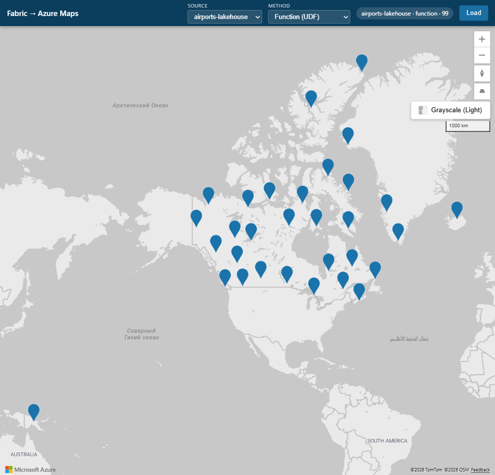

# Airports: Lakehouse table

This source renders up to 100 rows from Lakehouse table `dbo.airports` as
GeoJSON points.

The physical columns are `_c0` through `_c13`. Latitude is `_c6`, longitude is
`_c7`, and the first table row contains text headers. The proxy's numeric
coordinate validation skips that header row automatically.



## Function

`AirportsApi.get_airports` receives a `FabricLakehouseClient` through alias
`airportslh`, calls `lakehouse.connectToSql()`, and runs:

```sql
SELECT TOP 100 * FROM dbo.airports
```

The function returns a list of row dictionaries. The proxy invokes it with a
Microsoft Entra token for
`https://analysis.windows.net/powerbi/api`, converts numeric `_c6`/`_c7`
values to `[longitude, latitude]`, and skips rows without valid coordinates.

## Direct

The proxy connects to the `TejitLH` SQL analytics endpoint with the Node
`mssql` package and a Microsoft Entra access token for
`https://database.windows.net`.

The shared endpoint is:

```text
x6eps4xrq2xudenlfv6naeo3i4-gj7qoyi22kiupm4dzlf534rc6u.msit-datawarehouse.fabric.microsoft.com
```

It runs the same `SELECT TOP 100 *` query and performs the same GeoJSON
conversion.

## Setup & permissions

1. In workspace `61077f32-d21a-4791-b383-cacbddf222f5`, create or open
   Lakehouse `TejitLH`
   (`b97fcfa2-6e58-4898-ab81-00ed5d1396cb`).
2. Create/load table `dbo.airports` with physical columns `_c0` through `_c13`.
   Preserve latitude in `_c6` and longitude in `_c7`. A text header row may
   remain as the first row because nonnumeric coordinates are filtered.
3. Confirm that the Lakehouse SQL analytics endpoint exposes
   `dbo.airports`.
4. From `fabric-udf`, create the UDF item and upload its definition:

   ```powershell
   python deploy_udf.py --spec airports/spec.json --script airports/function_app.py
   ```

   To update an existing item, add `--udf <udf-id>`.
5. The spec creates `AirportsApi` and binds alias `airportslh` to `TejitLH`
   through `connectedDataSources`. The connection is auto-wired; no manual
   **Manage connections** step is required.
6. The deployer needs permission to create/update the UDF item, bind the
   Lakehouse, and read/test the Lakehouse SQL endpoint. The bound
   `FabricLakehouseClient` supplies the UDF's SQL connection.
7. In the portal, open `AirportsApi`, select **Develop > Publish**, wait for
   publishing, switch to **Run only**, then open
   `get_airports > ... > Properties`, confirm **Public access = On**, and copy
   the Public URL.
8. Put the URL and SQL endpoint settings in the gitignored `.env` file:

   ```text
   SQL_ENDPOINT=x6eps4xrq2xudenlfv6naeo3i4-gj7qoyi22kiupm4dzlf534rc6u.msit-datawarehouse.fabric.microsoft.com
   SQL_DATABASE=TejitLH
   UDF_AIRPORTS_ENDPOINT=<published get_airports URL>
   ```

Allow about two minutes between publishes. The published URL always requires a
Microsoft Entra invocation token.

See the [common UDF guide](../common-udf-guide.md) for shared UDF deployment
and permission details.

## What the Direct method needs

The identity running the proxy must:

- run `az login`;
- have read access on the `TejitLH` SQL analytics endpoint; and
- be able to obtain a token for `https://database.windows.net`.

Direct mode does not use OneLake DFS or the published UDF.
