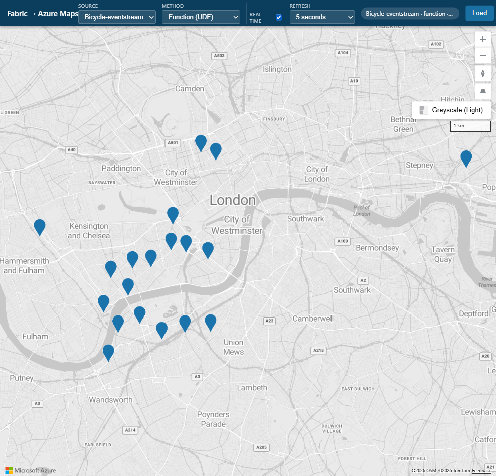

# London bicycles: Eventstream landing table

This source renders live London bicycle events from Fabric Eventstream
`SampleES`, whose source is `sample-bicycles`. The Eventstream lands events in
table `BicycleES` in KQL database `BicycleES`.

Rows include `Latitude`, `Longitude`, `No_Bikes`, `No_Empty_Docks`, `Street`,
`Neighbourhood`, and `BikepointID`.



## Create the Eventstream destination

An Eventstream source is not queryable until it writes to a destination:

1. Open Eventstream `SampleES` in the Fabric portal.
2. Confirm its source is `sample-bicycles`.
3. Select **Add destination > Eventhouse**.
4. Choose or create a KQL database named `BicycleES`.
5. Choose or create a destination table named `BicycleES` and map the incoming
   bicycle fields.
6. Start/publish the Eventstream and confirm that events are landing.

The `sample-bicycles` source continuously produces events, so the
`BicycleES` row count should keep increasing.

The destination is on:

```text
https://trd-tne4bs58upcvrph9ak.z1.kusto.fabric.microsoft.com
```

## Function

`EventstreamApi.get_bikes` uses `azure-kusto-data` and the UDF runtime's
managed identity to query the newest approximately 100 rows:

```kusto
table("BicycleES")
| where isnotnull(Latitude) and isnotnull(Longitude)
| extend __ingestion_time = ingestion_time()
| order by __ingestion_time desc nulls last
| take 100
| project-away __ingestion_time
```

Kusto/Eventhouse is not a supported UDF managed connection. The function uses
`DefaultAzureCredential` with an Azure token-credential builder when
available, then falls back to the SDK managed-identity builders.

The proxy invokes the published UDF with a token for
`https://analysis.windows.net/powerbi/api` and converts the returned rows to
GeoJSON points.

## Direct

The proxy runs the same newest-first query against KQL database/table
`BicycleES` through Kusto REST. It obtains a token for
`https://api.kusto.windows.net`; normal queries use `/v2/rest/query`.

The UI's real-time toggle controls repeated fetches. Available intervals are 5
seconds, 10 seconds, 30 seconds, 1 minute, and 5 minutes. When the toggle is
off, the browser does not re-fetch automatically.

## Setup & permissions

1. Create the Eventstream destination as described above and verify that
   `BicycleES` is receiving rows.
2. Edit `CLUSTER_URI`, `DATABASE`, and `TABLE` at the top of
   `fabric-udf/eventstream_function_app.py` to match the Eventhouse
   destination.
3. In the Fabric portal, create a **User Data Functions** item, open it in
   **Develop** mode, and paste
   `fabric-udf/eventstream_function_app.py`. Add the public PyPI package
   `azure-kusto-data` version `6.0.4` in the UDF environment/library
   management experience.
4. There is no managed Kusto connection for this UDF. It uses the UDF runtime
   managed identity.
5. Select **Publish**, wait for
   publishing, switch to **Run only**, then open
   `get_bikes > ... > Properties`, set **Public access = On**, and copy the
   Public URL.
6. Set the Direct-mode landing destination and UDF endpoint in
   `config/constants.js`:

   ```javascript
   eventstream: {
     kustoUri: "https://trd-tne4bs58upcvrph9ak.z1.kusto.fabric.microsoft.com",
     kustoDb: "BicycleES",
     table: "BicycleES"
   },
   udf: {
     eventstream: "<published get_bikes URL>"
   }
   ```

7. Invoke `get_bikes` once. The first call should fail with HTTP 403 and expose
   a principal such as `aadapp=<clientId>;<tenantId>`.
8. Copy the complete principal. As a database administrator, run:

   ```kusto
   .add database BicycleES viewers ('aadapp=<clientId>;<tenantId>') 'Allow EventstreamApi UDF to read live bicycle data'
   ```

   Run the command in the Eventhouse query editor or submit it to
   `<cluster>/v1/rest/mgmt`.
9. Invoke the function again; it should now return bicycle rows.

In this deployment, the `EventstreamApi` managed identity has application ID
`8ce609ad-383b-4471-9b36-0d42ec532c00`. Copy the complete principal from the
403 so the tenant ID is included.

The signed-in UDF creator needs write permission on the UDF item. A database administrator
must grant the UDF identity Database Viewer on database `BicycleES`. The proxy
runner needs permission to invoke the published UDF.

Allow about two minutes between publishes. See the
[common UDF guide](../common-udf-guide.md) for the shared creation and
managed-identity permission model.

## What the Direct method needs

The identity running the proxy must:

- run `az login`;
- have Viewer permission on KQL database `BicycleES`; and
- be able to obtain a token for `https://api.kusto.windows.net`.

The Direct method uses the runner's identity, not the UDF managed identity.
