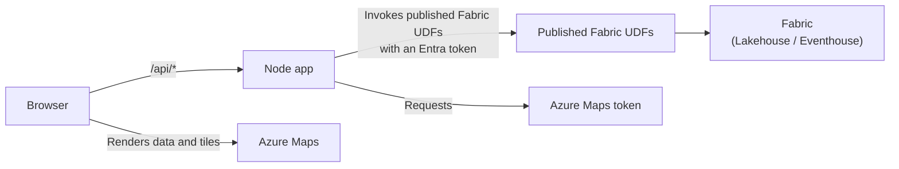

# Set up the Fabric User Data Functions

> **Journey:** [Data setup](data_setup.md) → **UDF setup** → [App deployment](app-guide.md) → [Authorization](auth.md)

## What a Fabric UDF is

A Fabric User Data Function (UDF) is serverless Python hosted in Microsoft Fabric. When you publish it, Fabric exposes an internet-reachable REST endpoint protected by Microsoft Entra ID. In this solution, each UDF is a controlled boundary that returns only the data the map needs.

For Lakehouse data, you add a Fabric-managed connection and Fabric brokers access without credentials in your code. For Eventhouse/Kusto data, the UDF uses its own managed identity and needs permission to read the database.

The lifecycle is **Develop → Publish → Run only → Public access on → invoke with a Microsoft Entra token**. Public access makes the endpoint reachable by the Node app, while Microsoft Entra authentication restricts who can run it.

### Read more

- For reference, see [Fabric user data functions overview](https://learn.microsoft.com/en-us/fabric/data-engineering/user-data-functions/user-data-functions-overview).
- For reference, see [Create a UDF item in the portal](https://learn.microsoft.com/en-us/fabric/data-engineering/user-data-functions/create-user-data-functions-portal).
- For reference, see [Connect to data sources](https://learn.microsoft.com/en-us/fabric/data-engineering/user-data-functions/connect-to-data-sources).
- For reference, see [Invoke a UDF from an application](https://learn.microsoft.com/en-us/fabric/data-engineering/user-data-functions/tutorial-invoke-from-python-app).
- For reference, see [Service details and limitations](https://learn.microsoft.com/en-us/fabric/data-engineering/user-data-functions/user-data-functions-service-limits).

## Architecture

The browser requests configuration, data, tokens, and PMTiles byte ranges from the Node app. The Node app invokes published Fabric UDFs with a Microsoft Entra token, and the UDFs read the configured Fabric sources. The browser never receives Fabric tokens.



| Route | Purpose |
| --- | --- |
| `/api/config` | Returns the map configuration. |
| `/api/data?source=` | Returns data for car parks, airports, or Eventstream. |
| `/api/maps-token` | Returns a short-lived Azure Maps token. |
| `/api/pmtiles-archive` | Serves the PMTiles archive with HTTP Range support. |

The PMTiles UDF returns the archive as base64, the Node app caches it and serves it over the HTTP Range endpoint, and the browser renders it with the Azure Maps `pmtiles://` custom protocol via `pmtiles.js`.

For reference, see [Add the PMTiles custom protocol to Azure Maps](https://learn.microsoft.com/en-us/azure/azure-maps/add-custom-protocol-pmtiles).

## Set up the Lakehouse UDFs

Use these shared steps for the car parks, PMTiles, and airports UDFs:

1. In the Fabric workspace, create a **User Data Functions** item.
2. Open **Develop** and replace the sample code with the matching Python file from the table.
3. Select **Manage connections**, add the Lakehouse created during [Data setup](data_setup.md), set the exact alias, and select the listed connection type.
4. Select **Publish**.
5. Switch to **Run only**, open the function **Properties**, and set **Public access = On**.
6. Copy the **Public URL** for use in the matching `config/constants.js` key.

| Source | Python file | Function | Alias | Connect | Config key |
| --- | --- | --- | --- | --- | --- |
| Car parks | `fabric-udf/carpark_function_app.py` | `get_car_parks` | `carparkslh` | `connectToFiles` | `udf.carpark` |
| PMTiles | `fabric-udf/pmtiles_function_app.py` | `get_gpstrace_pmtiles` | `gpstracelh` | `connectToFiles` | `udf.pmtiles` |
| Airports | `fabric-udf/airports_function_app.py` | `get_airports` | `airportslh` | `connectToSql` | `udf.airports` |

The car parks and PMTiles UDFs read `Car_Parks.geojson` and `GpsTrace.pmtiles` from the Lakehouse `Files/` root. The airports UDF reads `dbo.airports`.

For reference, see [Create a UDF item in the portal](https://learn.microsoft.com/en-us/fabric/data-engineering/user-data-functions/create-user-data-functions-portal) and [Connect Fabric UDFs to data sources](https://learn.microsoft.com/en-us/fabric/data-engineering/user-data-functions/connect-to-data-sources).

## Set up the Eventstream UDF

1. Create a **User Data Functions** item and paste `fabric-udf/eventstream_function_app.py` into **Develop**.
2. Open **Library management** and add the latest compatible `azure-kusto-data` library.
3. Set `CLUSTER_URI`, `DATABASE`, and `TABLE` from the values recorded during [Data setup](data_setup.md). Set `TABLE` to `BicycleES`.
4. Select **Publish**.
5. Switch to **Run only**, open the function **Properties**, and set **Public access = On**.
6. Copy the **Public URL** into `udf.eventstream`.

Do not add a managed connection.

## Update `config/constants.js`

`config/constants.js` holds `mapsClientId` and the four non-secret UDF Public URLs in `udf.carpark`, `udf.pmtiles`, `udf.airports`, and `udf.eventstream`; edit the repository file and commit it with the app. Hosting environment variables are covered in [App deployment](app-guide.md).

## Verify the UDFs in the Fabric portal

In **Run only** mode, open each function, invoke it with an empty body, and confirm it returns the expected data:

| UDF | Expected output |
| --- | --- |
| Car parks | GeoJSON |
| PMTiles | A base64 string |
| Airports | Rows |
| Bicycles | Rows |

A successful return also confirms that the UDF can read its underlying data source.

The first Eventstream UDF invocation fails with a Kusto authorization error such as `Principal 'aadapp=<clientId>;<tenantId>' is not authorized to read database '<db>'`. Copy the principal from the error, open the Eventhouse/KQL query editor for the database, and run:

```kusto
.add database <db> viewers ('aadapp=<clientId>;<tenantId>') 'Allow the Fabric UDF to read this database'
```

For the complete permission steps, see [Grant the Eventstream UDF Kusto access](auth.md#grant-the-eventstream-udf-kusto-access).

You are ready to continue when all four UDFs return output in the Fabric portal.

## Next step

Continue to [App deployment](app-guide.md).
